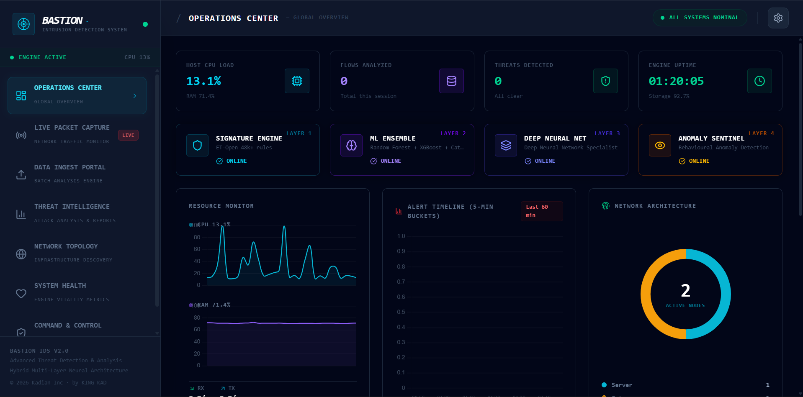
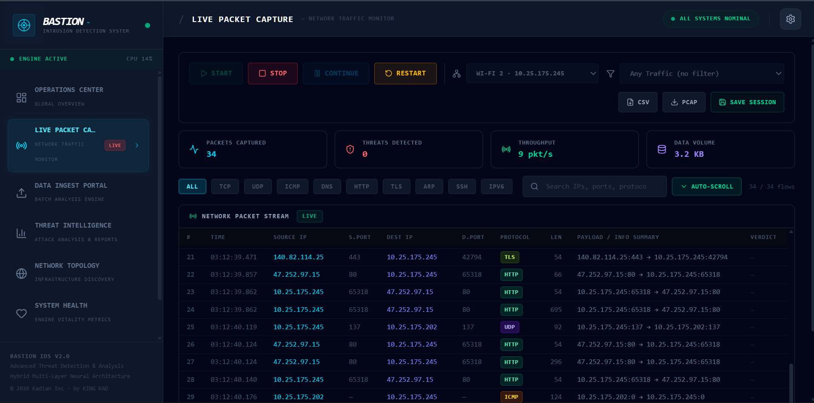
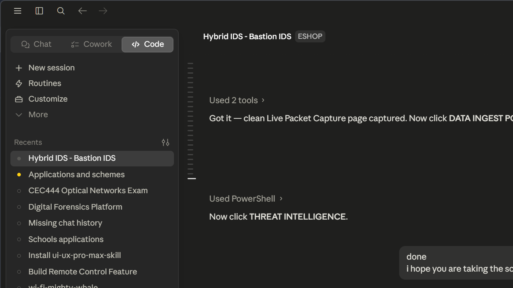
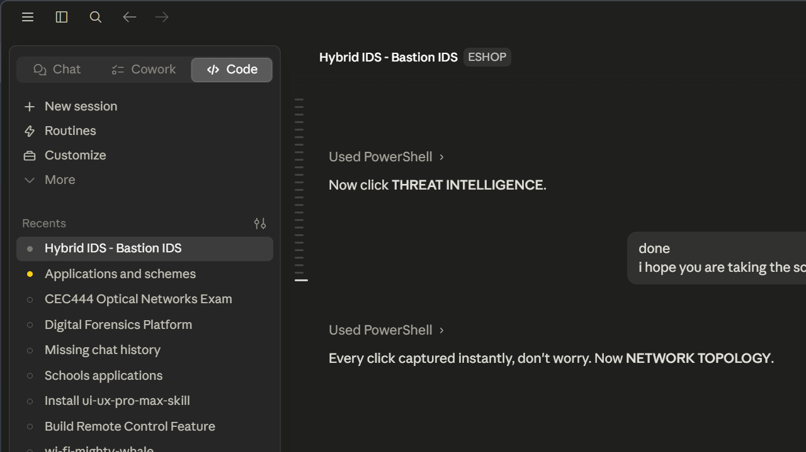
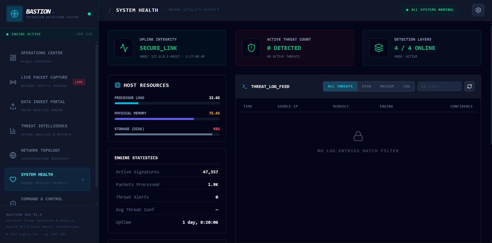
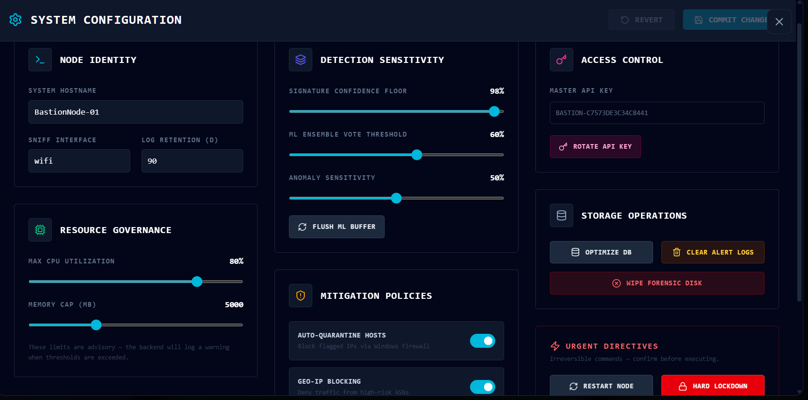

# Bastion IDS


A network intrusion detection system that combines signature matching, machine learning, deep learning, and behavioural anomaly detection into one pipeline. Built from scratch. Ships with a real-time SOC-style dashboard.



## What it does

Bastion IDS watches your network traffic and tells you when something is wrong. It runs four detection methods in sequence on every flow, each one catches a different class of threat.

When a packet hits the wire, Bastion checks it against 47,357 known attack signatures first (fast, no false positives on known threats), then runs it through three layers of trained AI models that pick up patterns the signatures miss, including attacks that have never been seen before.

Everything shows up in a live dashboard that looks like a real SOC packet table, threat log, network map, system health gauges, and a deep-dive forensic view for each alert.

## Detection pipeline

```
Network traffic
      │
      ▼
┌─────────────────────────────────────────────────────────┐
│  Layer 1 — Signature Engine                             │
│  47,357 Emerging Threats (ET-Open) rules + port/scan    │
│  heuristics. Instant verdict on known attacks.          │
└──────────────────────────┬──────────────────────────────┘
                           │ (if no signature match)
                           ▼
┌─────────────────────────────────────────────────────────┐
│  Layer 2 — ML Ensemble                                  │
│  Random Forest + XGBoost + CatBoost vote on the flow.   │
│  Consensus of 2+ models or single model at 92%+ fires.  │
└──────────────────────────┬──────────────────────────────┘
                           │ (if no consensus)
                           ▼
┌─────────────────────────────────────────────────────────┐
│  Layer 3 — Deep Neural Network Specialist               │
│  DNN trained on UNSW-NB15 takes a final look.           │
│  Fires at 85%+ confidence on any malicious category.    │
└──────────────────────────┬──────────────────────────────┘
                           │ (always runs in parallel)
                           ▼
┌─────────────────────────────────────────────────────────┐
│  Layer 4 — Behavioural Anomaly Engine                   │
│  Distribution-independent, threshold-gated detectors.   │
│  Catches ICMP covert channels and DNS tunnelling —      │
│  zero-day techniques with no existing signatures.       │
└──────────────────────────┬──────────────────────────────┘
                           │
                           ▼
                    Alert → Dashboard
```

**Trained on:** UNSW-NB15 (Australian Centre for Cyber Security) 49 features, 9 attack categories.

**Performance (batch analysis on labelled data) can be tuned and retrained on context-based traffic which improves overall performance on the monitored network:**

| Metric | Score |
|--------|-------|
| Accuracy | 85.6% |
| Precision | 94.9% |
| F1 Score | 0.89 |

## Research and training

The AI component is the core of this work. The application exists to demonstrate that the models work on real traffic, not just benchmarks.

**Dataset:** UNSW-NB15 (175,341 training + 82,332 test records, 9 attack categories) combined with CICIDS 2018-02-14 (400,000 flows) for a total corpus of 657,673 samples across 10 classes. The dataset is severely imbalanced — Worms has 174 training samples, Backdoor has 2,329, while Exploits has 44,525 and Normal has 93,000+.

**Leakage prevention:** The preprocessor (StandardScaler + OrdinalEncoder) was fitted exclusively on the training set and applied identically to the test set. SMOTE was applied after the split and only to training data. The test set of 131,535 samples (20%) was never touched during any fitting step. IP addresses, timestamps, and port identifiers that would allow models to memorise endpoints rather than learn behaviour were excluded from the feature vector.

**Class imbalance:** Addressed at three levels. SMOTE and variants were applied to bring all minority classes to a minimum of 800 samples in the training set. Random Forest used `class_weight="balanced"`, CatBoost used `auto_class_weights="Balanced"`, and the DNN used computed class weights passed at training time.

**Overfitting prevention:** Random Forest and XGBoost used RandomizedSearchCV with 3-fold cross-validation (12 and 15 iterations respectively). CatBoost used early stopping with patience 30 and stopped at iteration 128 of 500. The DNN (Residual MLP) used dropout across three stages (0.3, 0.25, 0.2), batch normalisation, early stopping at patience 8 on validation accuracy, and ReduceLROnPlateau. The autoencoder early-stopped at epoch 74 of 80.

**Results on the held-out test set (131,535 samples):**

| Model | Accuracy | F1 (weighted) | AUC-ROC (macro) | MCC |
|-------|----------|---------------|-----------------|-----|
| XGBoost | 93.39% | 0.9220 | 0.9899 | 0.8752 |
| Random Forest | 90.77% | 0.9227 | 0.9851 | 0.8403 |
| Hybrid Ensemble | 90.37% | 0.9196 | 0.9872 | 0.8353 |
| DNN (Residual MLP) | 87.37% | 0.8999 | 0.9858 | 0.7918 |
| CatBoost | 87.16% | 0.9003 | 0.9863 | 0.7870 |

Macro F1 scores are lower (0.53-0.62) because ultra-minority classes like Worms (35 test samples) and Backdoor (466) drag the unweighted average down — this is expected and honest on a severely imbalanced dataset. The AUC-ROC scores above 0.985 across all models indicate strong discriminative ability across all 10 classes regardless of class size.

The autoencoder (Layer 4) was trained exclusively on normal traffic. At the operational threshold, it achieves a 3% false positive rate while producing a mean reconstruction error on attack traffic (11.89 MSE) that is 245 times higher than on normal traffic (0.048 MSE), giving the anomaly engine a clear separation signal for zero-day detection.

## System Requirements

| Requirement | Minimum |
|---|---|
| OS | Windows 10 (build 1903 / version 1909) or Windows 11 |
| CPU | 64-bit with AVX support — Intel Sandy Bridge (2011) or newer, AMD Bulldozer (2011) or newer |
| RAM | 4 GB minimum — 8 GB recommended |
| Storage | 4 GB free space |
| Privileges | Administrator — required for live packet capture |

> **Note on older CPUs:** Layer 3 (Deep Neural Network) runs on TensorFlow, which requires AVX. On machines without it, the DNN layer is disabled automatically but Layers 1, 2, and 4 continue to operate normally (3/4 layers shown in the dashboard).

The installer bundles Npcap and the Visual C++ 2022 Runtime. The Visual C++ Runtime installs automatically; the Npcap driver opens its short setup wizard during installation for you to click through (its licence requires this).

## Download

**[Download Bastion IDS Setup 2.0.0 for Windows →](https://github.com/kadian-arch/bastion-ids/releases/latest)**

The installer includes all trained models, the Python runtime, Npcap, and the Visual C++ Runtime — everything is bundled, no additional downloads required. During setup the Npcap driver shows a short wizard to click through (its licence requires this); the rest installs automatically.

## Running from source

**Requirements:** Python 3.12, Node.js 18+, Npcap (for live capture)

```bash
git clone https://github.com/kadian-arch/bastion-ids.git
cd bastion-ids
```

**Download models:**
The trained model files are large and not in the repo. Download them from the [latest release](https://github.com/kadian-arch/bastion-ids/releases/latest) → `models.zip`, then extract into the `models/` folder.

**Download ET-Open rules:**
```bash
curl -L https://rules.emergingthreats.net/open/suricata-5.0/emerging.rules.tar.gz -o rules/emerging.rules.tar.gz
tar -xzf rules/emerging.rules.tar.gz -C rules/
```

**Install dependencies:**
```bash
python -m venv venv
venv\Scripts\activate
pip install -r requirements.txt

cd app-desktop
npm install
```

**Start the system:**
```bash
# Terminal 1, backend (run as Administrator for live capture)
venv\Scripts\activate
python api_server.py

# Terminal 2 — frontend
cd app-desktop
npm run dev
# Open http://localhost:48218
```

---

## What Bastion is (and isn't)

Bastion is a **Network Intrusion Detection System (NIDS)**. It monitors traffic and raises alerts. It does not block anything on its own.

The dashboard includes response controls (port quarantine, IP blocking) designed to work alongside a firewall or network enforcement device. Without that integration they show intent; with it they trigger real action.


## Dashboard pages

**Operations Center**: Live stats (CPU, flows analyzed, threats detected, engine uptime) plus real-time resource graphs and network architecture overview. Shows all 4 detection layers with live status.

**Live Packet Capture**: Wireshark-style table streaming real packets off the wire. Filter by protocol (TCP, UDP, ICMP, DNS, HTTP, TLS, ARP, SSH). Threats highlighted in red. Click any row for the full forensic breakdown which engine flagged it, confidence, raw hex and BPF capability to narrow down to a particular traffic capture type.

**Data Ingest Portal**: Drop a `.csv`, `.pcap`, or `.log` file and run a full ML sweep across all flows. Good for post-incident analysis of captured traffic.

**Threat Intelligence**: Full alert log with severity filter, IP/type search, and CSV export. Every analysis session can be saved as a permanent detection log and reopened later from a session picker — logs survive restarts and are only removed on uninstall or manual delete. Click any alert for the deep-dive report: neural weight distribution chart, raw packet hex dump, and analyst verification (mark true/false positive, add notes). Forensic reports also generated in three different formats and downloadable in any desired of three, csv, html and pdf(which can be submitted in legal situations like court hearings).

**Network Topology**: Live ARP scan of the local subnet visualized as a node map. Classifies devices as server, gateway, or workstation, performs basic host info discovery such as OS.

**System Health**: CPU, RAM, storage, and network I/O gauges, updated every 3 seconds.

**Command & Control**: Admin panel for policy controls, settings, API key rotation, alert archiving, and engine management.

Every alert carries a MITRE ATT&CK technique mapping. Live capture sessions can be exported as CSV or raw PCAP (Wireshark-compatible) directly from the dashboard.

## Protective controls

**Auto-Isolate**: Automatically blocks threat source IPs at the Windows Firewall level the moment an alert fires, both inbound and outbound.

**Ghost Protocol**: Blocks ICMP echo so the host does not respond to ping, reducing visibility to network scanners.

**Stealth Mode**: Blocks mDNS (UDP 5353), hiding the host from network discovery tools.

**Emergency Lockdown**: Hard stop on all capture, analysis, and file upload operations until manually released.

All controls are toggled from the Command & Control page and take effect immediately without restart.

## Analyst feedback and model retraining

Every alert can be reviewed directly in the Threat Intelligence page. Analysts can mark verdicts as true or false positives, add investigation notes, and correct wrong labels. The accumulated feedback exports as a CSV dataset for use in retraining the ML models on your specific network environment.


## Screenshots

| Operations Center | Live Packet Capture |
|---|---|
|  |  |

| Threat Intelligence | Network Topology |
|---|---|
|  |  |

| System Health | Settings |
|---|---|
|  |  |


## Tech stack

**Backend:** Python 3.12, FastAPI, Uvicorn, Scapy, TensorFlow/Keras, XGBoost, CatBoost, scikit-learn, pandas

**Frontend:** Electron, React 18, Vite, TailwindCSS, Chart.js

**Models trained on:** UNSW-NB15 dataset and tuned on CICIDS2017 to broaden attack categories and introduce variant detection capabilities.


## Project background

This started as a final year project at the University of Buea (Network & Security). The goal was to go beyond simple signature matching and build something closer to how real enterprise IDS tools work layered detection, no single point of failure, and a UI that makes the data readable.

The source code is publicly available. If you're a researcher, a student, or someone who wants to understand how layered network detection works under the hood, everything is here.


## Troubleshooting

**Windows SmartScreen blocks the installer ("Windows protected your PC")**
This appears because the installer is not commercially code-signed. Click "More info" then "Run anyway." The installer is safe.

**"Error decompressing data! Corrupted installer?" during installation**
Windows Defender is quarantining files mid-extraction. Before running the installer, go to Windows Security → Virus & threat protection → Manage settings → turn off Real-time protection temporarily, complete the installation, then turn it back on. Alternatively add `C:\Program Files\Bastion IDS` or the install path you select as a Defender exclusion before running the installer.

**"Engine failed to start" on the splash screen**
The detection engine (Python backend) did not launch in time. Check `%TEMP%\BastionIDS-launch.log` for the exact error. Common causes: the app was not run as Administrator (right-click → Run as administrator), or antivirus software blocked the engine process. If the log shows a missing module, uninstall and reinstall. A corrupted installation is the most likely cause.

**Layer 3 (DNN) shows offline — the other layers keep working**
Bastion is designed to degrade gracefully: if TensorFlow cannot load, Layer 3 (the deep-learning specialist) is disabled but Layers 1 (signatures), 2 (ML ensemble) and 4 (anomaly detection) stay fully online, so the system remains protective. The status panel will show 3/4 layers active. Two causes:

1. **Visual C++ 2022 Runtime is outdated or missing.** The installer bundles and runs the current runtime automatically. If Layer 3 is still offline, install it manually and restart Bastion IDS:
   [vc_redist.x64.exe — Microsoft](https://aka.ms/vs/17/release/vc_redist.x64.exe)

2. **Your CPU does not support AVX.** TensorFlow requires AVX instructions (Intel Sandy Bridge / 2011 and newer, AMD Bulldozer / 2011 and newer). On older CPUs, Layer 3 cannot run at all — this is a hardware limit, not a bug. The other three layers are unaffected.

To check your CPU, run this in PowerShell:
```powershell
(Get-WmiObject -Class Win32_Processor).Name
```

**Live packet capture shows no traffic / "capture won't start"**
Live capture needs the Npcap driver. During installation, the Npcap setup wizard opens automatically — click through its prompts (the defaults are fine). Npcap's free edition does not allow silent installation, so this one interactive step is required. If you skipped it, re-run the Bastion installer or install Npcap from [npcap.com](https://npcap.com), then restart Bastion IDS. Also confirm the app is running as Administrator — without admin rights, Windows blocks raw packet capture.

**First launch takes ~3-4 minutes (sometimes longer)**
Normal. On first launch the AI models load from disk and a one-time font cache is built. Cold start on a slow disk can take several minutes; the splash screen waits up to 6 minutes before reporting a failure. Subsequent launches are much faster.

**Windows Firewall asks to allow Python on first launch**
Click Allow. That prompt is the Bastion detection engine — it serves the dashboard locally on your own machine (127.0.0.1) and needs the permission to do so. Nothing is sent to the internet.

**The app installed but will not open at all**
Make sure you are on Windows 10 (build 1903 or later) or Windows 11. Windows 7/8 are not supported. Also confirm your machine has at least 4 GB of free RAM. The full model stack needs headroom to load.

If none of the above resolves your issue, open a GitHub issue with your `%TEMP%\BastionIDS-launch.log` attached, or email directly for one-on-one support: **kadian.security@gmail.com**

---

## Commercial & deployment

If you need Bastion IDS deployed in your organization, want it customized for a specific environment, or need ongoing monitoring support, reach out:

**kadian.security@gmail.com**


## License

Proprietary. Free to download and use for network security monitoring. Redistribution, modification, and commercial use without written permission from Kadian Inc are not permitted. See `build/eula.txt` in the installer for full terms.

---

*Built by [K. Donalsien](https://github.com/kadian-arch) · Kadian Inc · 2026*
